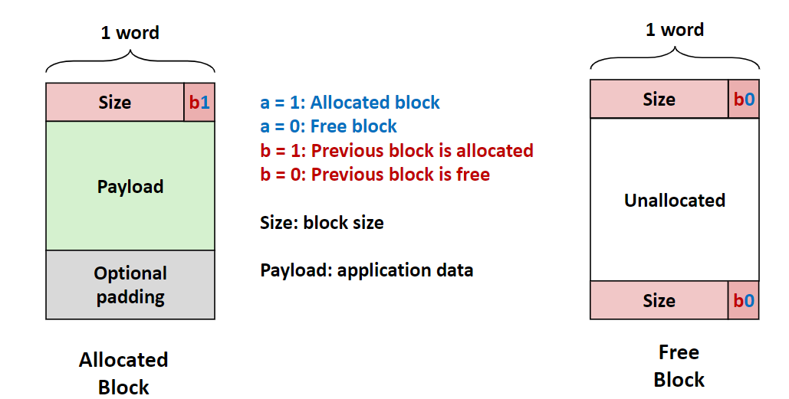

# 计算机系统

## 内存管理

### 内存分配

**内存分配和释放的最佳实践是分离链表加平衡二叉搜索树，实际上可以看做是一个HashMap**

> 提高处理内存申请和释放操作的吞吐量（单位时间满足请求），提高内存利用率（减少内部碎片和外部碎片）。两者不可能同时很好满足，需要适当衡量。

#### 需要解决的问题

##### 0x01. free内存时，如何通过指针获取该内存块的大小？

需要额外的空间。通过在申请块的头部（header field）字添加标记，标记此区域的大小

##### 0x02. 如何记录未被分配的块？

一共有4种方法。

- 隐式链表（申请需要O(n)复杂度，实际不会使用，可能用于特殊程序）

  > 连接所有的块。需要标记当前块是已分配的还是空闲的。

  

  

- 显示链表

  > 需要额外的块来存储指针

- 单独的链表记录（Segregated free list）

  > 不同大小量级的块记录到不同的链表中，申请时酌情分配。。

- 平衡二叉树（eg.红黑树）记录

  > 平衡的二分查找树（BBST）存储。key是大小，value是地址

##### 0x03. 如何找到一个合适的空闲块来满足申请的请求（隐式链表示例）

常见三种方式

- 首次匹配

  > 每次都从链表开始搜索满足申请的空闲块，遇到第一个合适的块就分配。实际应用中链表开始会碎片化。

- 二次匹配

  > 每次查找都从上次完成申请时的块开始搜索，遇到第一个合适的就分配。比首次分配更快，因为不用重复搜搜无用块。实际可能碎片化更严重。

- 最佳匹配

  > 遍历链表，找到满足的最小块，然后分配。这样提高了内存利用率。大多数情况比首次分配要慢。

##### 0x04.  释放内存块后的合并问题

**合并策略：**

- 立即合并：free时合并
- 推迟合并：外部碎片太多时合并；malloc需要块时合并

**一些合并情况：**

- 对于情况1，修改为空闲，直接释放。
- 对于情况2，修改为空闲，合并后续块，并修改大小
- 对于情况3，需要知道前驱块的大小才能合并
- 对于情况4，也需要知道前驱块大小才能合并

对于情况3和4，需要修改块的结构。

> 类似双向链表，这样可以通过上一个块的尾部来反向访问隐式链表了。

**进一步优化，已申请的块不需要尾部**

> 利用块大小是4字的整数倍的块，低2位空闲。将这两位当做标志位。

